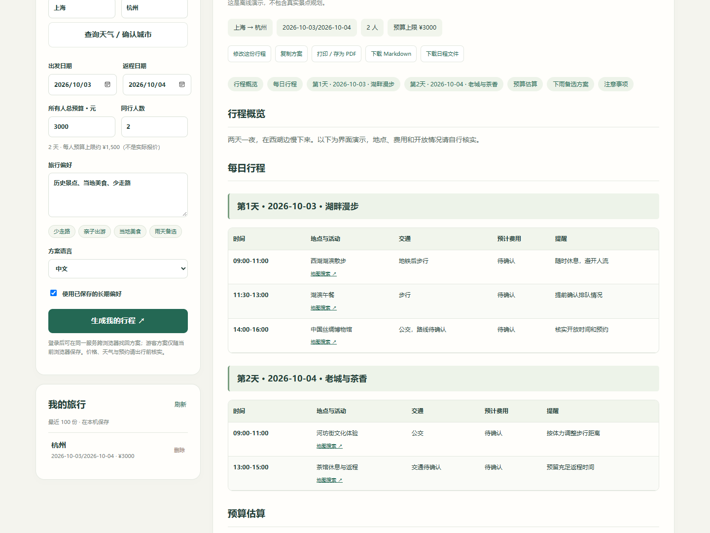
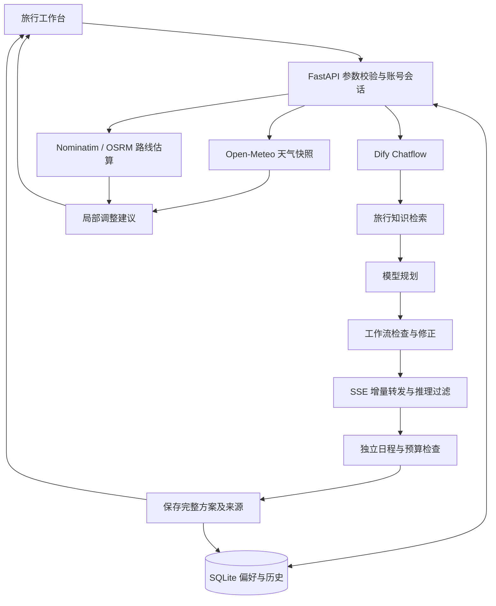

# 行旅 · Smart Travel Agent

<div align="center">


[](https://github.com/shjhijoaj/smart-travel-agent/actions/workflows/ci.yml)

**把旅行需求变成可查看、可核对、可修改的每日行程。**

基于 Dify Chatflow 与 FastAPI 的智能旅行规划工作台

由 [shjhijoaj](https://github.com/shjhijoaj) 与 [Codex](https://openai.com/codex/)（AI 编程协作）共同构建。

[功能特性](#功能特性) · [系统架构](#系统架构) · [快速开始](#快速开始) · [Docker 部署](#docker-部署) · [API 文档](docs/api.md) · [开发与测试](#开发与测试) · [参与作者](#参与作者) · [参考与致谢](#参考与致谢)

</div>

---

## 项目简介

行旅围绕「输入需求 → 知识检索 → 行程规划 → 规则检查 → 编辑与导出」构建旅行规划流程。输入目的地、日期、总预算和同行偏好后，可以按天查看行程，核对天气、预算与路线，再保存版本或导出方案。每个外部结果都尽量带有来源、时间和可核对的状态，方便用户在出行前继续确认。

项目将 Dify 的模型编排与独立的 Web 应用结合，提供账号、持久化偏好、历史版本和流式响应。当前版本为 **v0.4.0**，适合本地体验、单实例部署和 AI 应用工程学习。无需模型密钥即可运行明确标注的离线演示；配置 Dify 后可使用模型规划与知识库检索。

## 界面预览



<details>
<summary>查看手机界面</summary>


</details>

截图使用固定的虚构演示行程，用于展示界面，不代表实时天气、票价或真实预订结果。

## 一次规划的处理路径

1. **收集需求**：校验目的地、日期、总预算、同行人数和偏好；登录用户可选择是否带入自己保存的偏好。
2. **补充上下文**：确认同名城市，查询可用的天气快照；Dify Chatflow 内的检索节点为规划模型提供旅行知识。
3. **生成并检查**：模型按天生成方案，工作流检查并按条件修正；FastAPI 另行检查可解析的时间冲突、重复地点和预算算术。
4. **审阅与保存**：以 SSE 展示进度，保留检索来源和天气快照；用户可以编辑结构化日程、重新规划、保存版本或导出。

## 功能特性

### 旅行规划

- **知识库辅助规划**：Dify Chatflow 连接旅行知识检索、规划、检查与修正节点，返回资料来源供核对。
- **流式进度**：通过 SSE 转发上游节点状态和正文增量；过滤推理标签，只保存完整生成结果。
- **天气查询**：接入 Open-Meteo，支持同名城市确认，展示预报覆盖日期、来源与查询时间。
- **预算与日程检查**：独立规则识别可解析的时间冲突、重复地点及预算算术问题，未知费用保持待确认。
- **路线估算与调整建议**：Nominatim 地理编码与 OSRM 驾车道路估算；雨天、路线过长或文本中的闭馆提示可触发调整建议。

### 方案管理

- **账号与偏好**：注册、登录、修改密码、可撤销会话；SQLite 保存主动填写的长期偏好，可编辑、删除或按次关闭。
- **历史与版本**：账号之间隔离行程；修改需求后生成新版本，保留原方案。
- **结构化编辑**：编辑每日安排并保存；模型原文保留以便对照。
- **多种导出**：Markdown、浏览器打印 / PDF、全天日历提醒与出行清单。
- **桌面与手机适配**：宽屏表格和窄屏活动卡片，地点可跳转地图搜索。

### 工程实现

- FastAPI 参数校验、交互式 API 文档与统一错误反馈。
- 加盐密码哈希、HttpOnly 会话 Cookie、登录失败限流和同源写入检查。
- 运行次数、成功率、耗时及令牌 / 成本估算；估算不等于供应商账单。
- 59 项自动化测试、工作流规则用例、固定场景评测、浏览器回归与 GitHub Actions。
- Docker Compose 部署、SQLite 数据卷、健康检查和带 SHA256 清单的源码包。

## 技术栈

| 层次 | 技术 | 用途 |
| --- | --- | --- |
| 前端 | HTML / CSS / 原生 JavaScript | 响应式工作台、SSE 接收、行程渲染和导出 |
| API | Python / FastAPI / Pydantic / HTTPX | 参数校验、业务编排和外部服务调用 |
| 模型编排 | Dify Chatflow | 知识检索、规划、检查和修正；模型在 Dify 中配置 |
| 存储 | SQLite | 账号、会话、长期偏好、历史版本与运行记录 |
| 天气与地图 | Open-Meteo / Nominatim / OSRM | 城市查询、天气快照和道路估算 |
| 测试与部署 | pytest / Playwright / Docker / GitHub Actions | 自动回归、容器构建与源码打包 |

## 系统架构



实现细节见 [系统架构](docs/architecture.md) 和 [Dify 工作流配置](docs/SETUP_DIFY.md)。

## 快速开始

### 环境要求

推荐 Python 3.11，已在本机 Python 3.9 运行测试。需要 Git；容器部署另需 Docker 与 Docker Compose。离线演示无需 Dify，真实模型规划需要可访问的 Dify 应用及应用 API Key。

### 1. 克隆项目

```bash
git clone https://github.com/shjhijoaj/smart-travel-agent.git
cd smart-travel-agent
```

### 2. 安装并启动

Windows PowerShell：

```powershell
python -m venv .venv
.\.venv\Scripts\python.exe -m pip install -r requirements.txt
Copy-Item .env.example .env
.\.venv\Scripts\python.exe -m uvicorn api.main:app --host 127.0.0.1 --port 8010
```

macOS / Linux：

```bash
python3 -m venv .venv
.venv/bin/python -m pip install -r requirements.txt
cp .env.example .env
.venv/bin/python -m uvicorn api.main:app --host 127.0.0.1 --port 8010
```

已有 `.env` 时保留原配置。启动后访问 [旅行工作台](http://127.0.0.1:8010/)、[交互式 API 文档](http://127.0.0.1:8010/docs) 或 [健康检查](http://127.0.0.1:8010/api/health)。

### 3. 接入 Dify

1. 将 [工作流 DSL](workflow/smart-travel-agent.yml) 导入 Dify。
2. 配置模型插件与凭证，重新选择规划和检查节点使用的模型。
3. 创建知识库，导入 [旅行知识样例](knowledge/travel-knowledge.md)，在检索节点重新绑定知识库。
4. 确认规划节点的上下文连接检索结果，测试后发布应用并创建应用 API Key。
5. 在本机 `.env` 填入地址和 Key，将 `LOCAL_FALLBACK` 设为 `false`，然后重启服务。

```dotenv
DIFY_BASE_URL=http://localhost
DIFY_API_KEY=
DIFY_APP_MODE=advanced-chat
DIFY_TIMEOUT=120
LOCAL_FALLBACK=false
WEATHER_ENABLED=true
WEATHER_TRUST_ENV=false
```

`DIFY_BASE_URL` 填 Dify 站点地址，不含末尾 `/v1`；例如 Dify Cloud 使用 `https://api.dify.ai`。应用 Key 仅写入本机 `.env`，不要提交到 Git。完整步骤见 [Dify 配置说明](docs/SETUP_DIFY.md)。

### 使用流程

填写旅行需求 → 确认城市与天气 → 生成行程 → 核对提示和资料来源 → 编辑或重新规划 → 导出方案。

预算是所有同行人的总预算。登录后可保存长期偏好和历史；本次输入优先于长期偏好。出发前仍需核实开放时间、票价、预约和实际交通。

## Docker 部署

首次运行先从 `.env.example` 创建 `.env`，然后执行：

```bash
docker compose up -d --build
```

访问 [Docker 工作台](http://127.0.0.1:8000/)。无 Key 时运行离线演示；接入远程 Dify 时，在 `.env` 设置 `DIFY_DOCKER_BASE_URL` 和 `DIFY_API_KEY`。

如果 Dify 也在本机 Docker 中，且网络名为 `docker_default`：

```bash
docker compose -f docker-compose.yml -f docker-compose.dify.yml up -d --build
```

该配置通过容器网络里的 `http://nginx` 连接 Dify。网络不同可设置 `DIFY_DOCKER_NETWORK`；Docker Desktop 访问宿主机服务也可设置 `DIFY_DOCKER_BASE_URL=http://host.docker.internal`。

Compose 默认仅绑定本机端口，账号与历史保存在 `travel-data` 卷。普通重启、重建会保留数据，`docker compose down -v` 会删除数据卷。本地 Python 和 Docker 默认使用不同数据库，请固定使用一个入口。

## API 文档

| 方法 | 路径 | 功能 |
| --- | --- | --- |
| GET | `/api/health` | 进程健康检查 |
| POST | `/api/travel/plan` | 阻塞式生成行程 |
| POST | `/api/travel/stream` | SSE 流式生成行程 |
| POST | `/api/travel/weather` | 城市确认与天气查询 |
| POST | `/api/travel/route` | 道路距离与时间估算 |
| POST | `/api/travel/review` | 检查局部调整触发条件 |
| GET | `/api/history` | 当前账号 / 游客的历史 |
| PATCH | `/api/history/{id}/structured` | 保存结构化日程编辑 |
| GET | `/api/telemetry/summary` | 当前账号 / 游客的运行记录 |

完整字段、账号接口、错误码及 SSE 事件说明见 [API 文档](docs/api.md)。

### 最小调用示例

服务启动后，可以调用阻塞式接口验证离线演示（`DIFY_API_KEY` 留空，`LOCAL_FALLBACK=true`）：

```bash
curl -X POST http://127.0.0.1:8010/api/travel/plan \
  -H "Content-Type: application/json" \
  -d '{
    "departure": "上海",
    "destination": "广州",
    "travel_dates": "2026-10-01/2026-10-03",
    "budget": "5000",
    "companions": "2",
    "preferences": "慢节奏、历史文化"
  }'
```

响应中的 `answer` 是完整行程正文，`validation` 是独立规则检查；`weather` 记录天气快照，真实 Dify 返回引用时通过 `sources` 提供检索来源。接入真实 Dify 后，调用方式保持不变。

## 项目结构

```text
smart-travel-agent/
├── api/
│   ├── main.py              # API 入口、编排与版本管理
│   ├── accounts.py          # 账号、会话与长期偏好
│   ├── history.py           # SQLite 历史存储
│   ├── streaming.py         # Dify SSE 转发和推理过滤
│   ├── weather.py           # 城市与天气查询
│   ├── itinerary.py         # 行程解析与独立规则检查
│   ├── routes.py            # 地理编码与道路估算
│   ├── orchestration.py     # 局部调整条件检查
│   ├── telemetry.py         # 运行指标记录
│   └── static/              # 前端页面、样式与交互
├── workflow/                # 可导入的 Dify DSL
├── knowledge/               # 示例旅行知识库
├── prompts/                 # 规划与检查提示词
├── docs/                    # 架构、API、配置与展示图片
├── tests/                   # API 与浏览器回归
├── scripts/                 # 场景评测、联调与源码打包
├── .github/workflows/ci.yml # GitHub Actions
├── .env.example             # 无密钥配置样例
├── Dockerfile
└── docker-compose.yml
```

### 关键模块

| 模块 | 作用 |
| --- | --- |
| `api/main.py` | 统一入口、请求校验、规划编排和历史版本管理 |
| `api/streaming.py` | 解码 Dify SSE，过滤推理片段并转发可展示内容 |
| `api/itinerary.py` | 解析模型输出，执行时间、地点和预算规则检查 |
| `api/weather.py` / `api/routes.py` | 对接 Open-Meteo、Nominatim 和 OSRM，并保留服务状态 |
| `api/accounts.py` / `api/history.py` | 账号会话、显式偏好和 SQLite 历史隔离 |
| `workflow/` / `knowledge/` / `prompts/` | 可导入的 Dify 工作流、示例知识和提示词 |

## 开发与测试

激活虚拟环境后运行（Windows 也可使用 `.\.venv\Scripts\python.exe` 替代 `python`）：

```bash
python -m pytest -q
python tests/validate_workflow_cases.py
python scripts/evaluate_cases.py
python scripts/build_release.py
```

浏览器回归需先启动本地 8010 服务，并安装 Node.js 22：

```bash
npm install --no-save playwright@1.55.0
npx playwright install chromium
node tests/browser-smoke.cjs
node tests/browser-account.cjs
```

常规测试模拟模型 / 天气上游，固定场景评测使用离线演示，不消耗模型额度。账号浏览器测试会在测试服务中创建随机账号，建议通过 `TRAVEL_DB_PATH` 指定单独的测试数据库。

GitHub Actions 执行 API 测试、工作流校验、固定场景评测、浏览器回归、Docker 构建和源码打包。源码包输出到 `release/smart-travel-agent-v0.4.0.zip`，包含文件清单与 SHA256；运行数据、密钥、虚拟环境和个人交接资料不进入发布包。

## 贡献

欢迎通过 Issue 反馈问题或提出可复现的改进建议。提交 Pull Request 前，请先说明行为变化、外部服务影响和验证方式，并运行与改动相关的测试：

```bash
python -m pytest -q
python tests/validate_workflow_cases.py
python scripts/evaluate_cases.py
```

涉及 Dify DSL、知识库或外部服务时，请同时更新对应文档，并避免提交 `.env`、访问令牌、真实账号、个人行程和未获授权的第三方内容。小范围、单一目的的提交更便于审阅。

## 文档与版本

- [系统架构](docs/architecture.md)
- [Dify 配置](docs/SETUP_DIFY.md)
- [API 文档](docs/api.md)
- [外部服务与数据边界](docs/external-tools.md)
- [测试与真实联调](docs/testing.md)
- [v0.4.0 发布记录](docs/RELEASE.md)
- [后续计划](docs/roadmap.md)
- [参考与致谢清单](docs/CREDITS.md)

## 当前边界

- 长期记忆保存用户主动填写的偏好，尚未实现自动提取或向量语义记忆。
- 路线时间为 OSRM 驾车道路估算，不包含实时拥堵、公交 / 步行核验；没有订票或酒店库存服务。
- 局部调整提供规则建议和备注，不自动核实场馆开放情况或完成真实预订。
- 天气和引用资料是查询时的快照；知识库样例以广州为主，其他城市需补充资料。
- Dify 工作流先规划与检查，首段正文可能等待几十秒；令牌和成本数据为估算。
- 当前面向本地、单实例使用。公网运营需另外配置 HTTPS、注册和模型用量管理、备份及运维。

## 参与作者

| 参与者 | 角色与贡献 |
| --- | --- |
| [shjhijoaj](https://github.com/shjhijoaj) | 项目发起与维护：旅行场景需求、功能取舍、Dify 配置与项目发布。 |
| [Codex · OpenAI](https://openai.com/codex/) | AI 编程协作：协助接口与前端实现、测试编写和执行、问题定位、文档整理与发布。 |

感谢后续通过 Issue、Pull Request 和实际体验帮助改进项目的参与者。功能设计、发布与维护由仓库维护者决定。

## 参考与致谢


| 项目 / 服务 | 在行旅中的作用 |
| --- | --- |
| [Dify](https://github.com/langgenius/dify) | Chatflow 编排、模型接入与知识库检索 |
| [FastAPI](https://fastapi.tiangolo.com/) / [HTTPX](https://www.python-httpx.org/) | API 服务、参数校验与上游异步调用 |
| [Open-Meteo](https://open-meteo.com/) | 城市检索与天气预报快照 |
| [OpenStreetMap](https://www.openstreetmap.org/copyright) / [Nominatim](https://nominatim.org/) / [OSRM](https://project-osrm.org/) | 地点地理编码与道路距离、时间估算 |
| [SQLite](https://www.sqlite.org/) | 账号、偏好、历史版本与运行记录 |
| [pytest](https://pytest.org/) / [Playwright](https://playwright.dev/) | API 和浏览器回归验证 |
| [Docker](https://www.docker.com/) / [GitHub Actions](https://github.com/features/actions) | 可复现部署与持续集成 |
| [OpenAI Codex](https://openai.com/codex/) | 开发、测试、文档和发布中的 AI 协作支持 |

更多依赖与数据来源见 [参考与致谢清单](docs/CREDITS.md)。第三方组件与数据服务按各自许可证和条款使用。

## 联系与许可

问题、建议和复现步骤欢迎提交 [Issue](https://github.com/shjhijoaj/smart-travel-agent/issues)。仓库目前未指定开源许可证。
