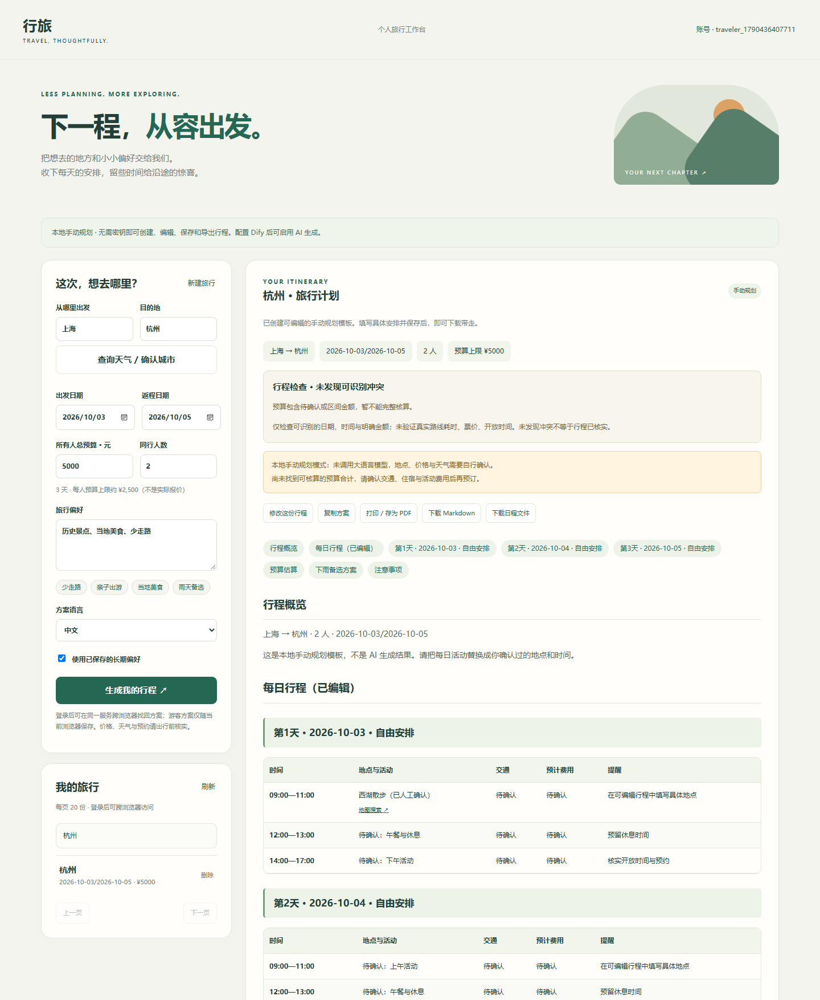

# 行旅 · 智能旅行规划 Agent

**把出发前的想法，变成可以修改、保存和带走的旅行日程。**

行旅将 Dify 旅行工作流与 FastAPI 服务、个人账号和交互式工作台连接起来。填写目的地、时间、预算和偏好后，流式查看规划进度，再逐天调整地点、交通与费用。没有配置模型服务时，也可以使用明确标识的手动规划模式。

个人维护项目 · Python / FastAPI / Dify / SQLite / JavaScript / Docker



## 能做什么

- **规划与修订**：Dify Chatflow 连接知识检索、生成、规则检查与修正；SSE 展示状态和正文。重新规划保存为新版本，保留原方案。
- **真正可编辑的日程**：按天增删活动，修改时间、地点、交通、预计费用和提醒；保存后，预览、Markdown 下载、日历和打印使用同一份修改结果。
- **个人旅行空间**：注册、登录、修改密码，保存长期偏好；游客方案在注册/登录后归入账号；历史支持搜索、分页和删除。
- **出行辅助**：天气城市确认、预报快照、地图搜索与驾车路线估算；显示外部数据来源，服务不可用时给出可读提示。
- **稳定运行**：参数校验、账号隔离、同源写入限制、生成频率和并发控制；只有完整生成才保存，运行统计异常不会丢弃行程。
- **离线可用的基础功能**：无需 API Key 即可创建手动行程、编辑、保存及导出；手动内容始终标识为“手动规划”。

## 快速开始

需要 Python 3.9+。Windows 双击 **`启动工作台.cmd`**；其他系统：

```bash
python -m venv .venv
# Windows: .venv\Scripts\activate
source .venv/bin/activate
python -m pip install -r requirements.txt
cp .env.example .env
python -m uvicorn api.main:app --host 127.0.0.1 --port 8790
```

打开 **http://127.0.0.1:8790**。首次安装依赖需要网络；后续手动规划不依赖模型服务。

### 启用 AI 规划

1. 在 Dify 导入 `workflow/` 中的旅行 Chatflow，选择可用模型并重新绑定知识库。
2. 按 [Dify 配置说明](docs/SETUP_DIFY.md) 发布应用，取得应用 API Key。
3. 在本机 `.env` 中填写 `DIFY_BASE_URL`、`DIFY_API_KEY`、`DIFY_APP_MODE=advanced-chat`，重启行旅。
4. 配置检查：`GET /api/ready`；实际连通性与生成需要调用上游，填写了配置不等于模型服务一定可用。

密钥只保存在本地 `.env`。仓库和发行包均不包含个人配置或数据库。

### Docker

复制 `.env.example` 为 `.env` 后执行 `docker compose up --build -d`，访问 **http://127.0.0.1:8790**。数据库保存在 `travel-data` 卷。容器访问宿主机 Dify 使用 `DIFY_DOCKER_BASE_URL`；与已有 Dify 网络连接见配置说明。

## 使用流程

1. 填写出发地、目的地、日期、总预算、人数和偏好。
2. 生成行程；确认来源标签是 AI 生成还是手动规划。
3. 在“把行程调整成你的节奏”中修改日程并保存。
4. 核查天气、预约和实际交通，下载 Markdown / 日历或打印为 PDF。
5. 注册账号保存偏好，在历史中检索、修订或删除旧行程。

## 验证与设计

2026-09-26 本地验证：**67 项 pytest 通过**；真实浏览器完成创建、编辑、保存、下载、搜索、注册、偏好与退出流程；390px 手机页面无横向溢出。另完成一次真实 Dify 两天行程生成，耗时 57.37 秒（单次记录，不代表性能保证）。

```bash
python -m pytest -q
python tests/validate_workflow_cases.py
python scripts/evaluate_cases.py
```

详见 [测试说明](docs/testing.md)、[使用与维护](docs/user-guide.md)、[架构](docs/architecture.md)、[接口](docs/api.md)。

适用于个人及小规模单实例部署。天气与路线依赖外部服务；价格、营业时间和预约仍需核实。本项目不进行订票、支付或无人确认的外部操作。多实例共享限流、邮件找回密码、运维告警与生产容量评估不在当前版本内。

## 阅读代码

`api/main.py` 路由入口 → `streaming.py` Dify/SSE → `itinerary.py` 内容分析 → `editor.py` 编辑回写 → `history.py` / `accounts.py` 数据持久化 → `static/` 前端。

- [参与者与第三方说明](docs/CREDITS.md)

代码许可见 [LICENSE](LICENSE)，第三方组件及外部服务遵循各自授权与使用条件。
