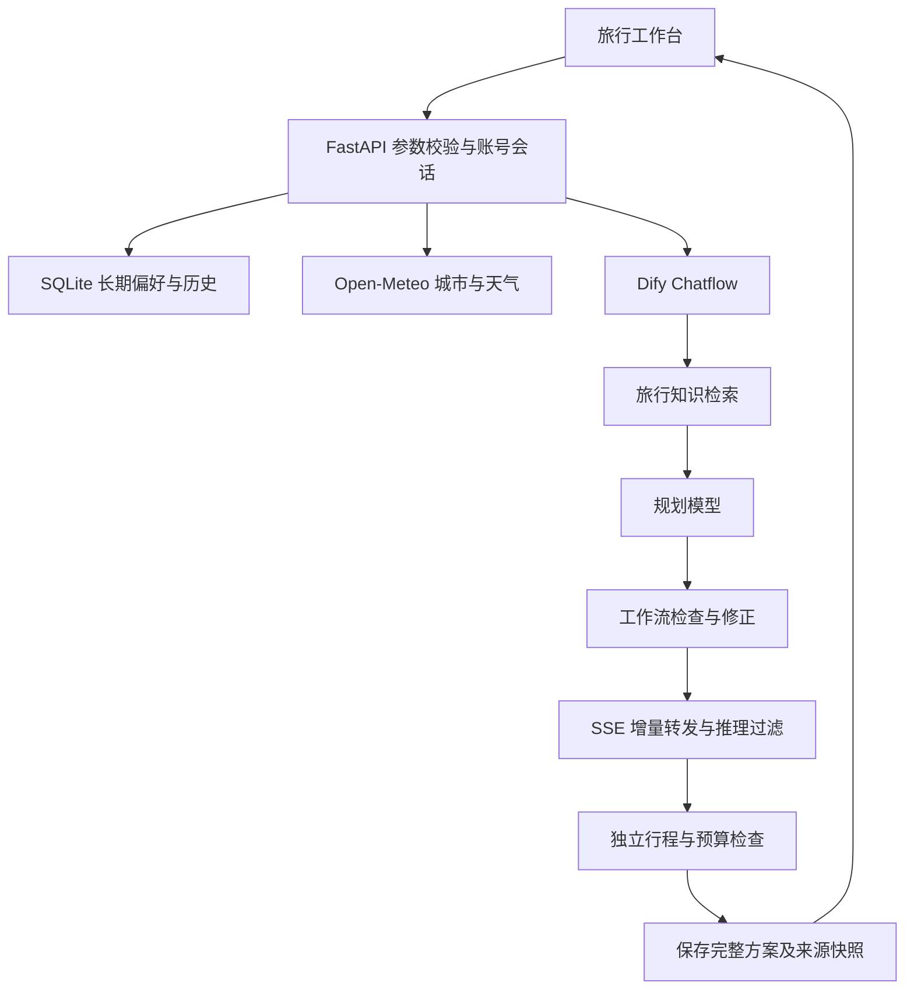

# 系统架构

默认 Chatflow 使用 /v1/chat-messages，也支持纯 Workflow 的 /v1/workflows/run；无 Key 时可用明确标注的手动规划。

账号使用加盐密码哈希、随机可撤销会话和用户 ID 隔离历史。游客以随机 HttpOnly Cookie 隔离，登录后可接收该浏览器的游客历史。Dify user 标识同样按账号/游客隔离。SQLite 存储账号、会话摘要、偏好和方案；Docker 使用命名卷保存。

长期偏好是用户显式文本。每次规划从账号读取，追加到当前需求的 preferences；本次输入优先，可按次关闭。重新规划还携带最多 16,000 字符旧方案作为参考，生成新的 parent_id 记录。

天气先确认城市，仅传递实际预报覆盖的日期。数据和知识检索来源随方案保存供审查。推理标签跨 SSE 片段过滤；前端安全使用 textContent 呈现模型内容，完成后渲染行程表格。只在上游完成后保存，中断请求尽力调用 stop。

本地 Dify 与旅行容器通过外部 docker_default 网络通信。普通 Compose 配置保留远程 Dify/宿主机部署方式。单实例 SQLite 适合当前规模，无分布式任务队列或自动语义记忆服务。

## 编辑与运行保护

editor.py 负责手动模板、编辑字段边界与 edited_plan 生成。原始 answer 保留，前端 planText 优先读取 edited_plan，保证保存、预览和导出一致。编辑失败不会提前替换本地当前方案。history.py 使用 owner 与查询参数进行隔离搜索、分页。

limits.py 为单进程提供每 IP 滑动窗口与全局生成信号量，流式响应结束或异常后释放名额；多进程需要外部共享限流。observability.py 隔离统计写入异常，不影响已完成的核心业务结果。
